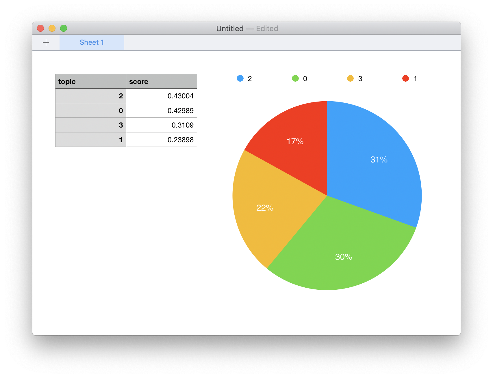

# Simplistic classification and visualizing topic models

This directory contains a set of files used to demonstrate two things: 1) a simplistic machine learning classification system, and 2) a couple of rudimentary methods for visualizing topic models. In the end, these things represent opportunities for librarianship. 

## Simplistic classification

This section describes the use of two Python scripts and a set of plain text files. The intent is to use these files to: 1) create/train a classification model, and 2) apply the model to a set of unclassified documents. It is assumed you already have Python installed. You will then want to install the necessary Python libraries/modules that will do the actual work, most specifically scikit-learn:

`pip3 install -r requirements.txt`

This repository has already been set up and configured for use. Consequently you ought to be able to run the following command (train.py) to create a classification model based on the contents of the alcott, emerson, longfellow, and thoreau directories:term

`python3 train.py model.bin alcott emerson longfellow thoreau`

The output is two-fold. First, the program will output an accuracy score, and the score ought to be pretty high, if not 100%. Second, a file named "model.bin" will be created in the current directory. Run the command a few times and notice how the accuracy score may change. This is do to the fact that the sample data is being divided into different training and test sets each time it is run.

Now that a model has been created, you can use it to classify other, unclassified documents. Again this repository has already been set up for doing so. To classify documents in the directory named unclassified, run:

`python3 classify.py model.bin unclassified`

Classify.py loads the model, applies it to all the files in the given directory, and outputs a set of label/file name combinations, something like this:

	  alcott      alcott-4770.txt
	  thoreau     thoreau-34392.txt
	  alcott      alcott-26041.txt
	  emerson     emerson-12843.txt
	  longfellow  longfellow-5436.txt
	  longfellow  longfellow-2039.txt
	  alcott      alcott-163.txt
	  alcott      alcott-38049.txt
	  alcott      alcott-34920.txt
	  longfellow  longfellow-9080.txt
	  emerson     emerson-6312.txt

In other words, the program "thinks" the file named emerson-6312.txt was written by Emerson, and the file named alcott-26041.txt was written by Alcott. This is particular case, the training and classification scripts worked perfectly. To experiment some more, try this:

   1. return all the files in the unclassified directory to their respective author directories
   2. randomly pick a few files from each author directory and put them into the unclassified directory
   3. as before, run `train.py`
   4. as before, run `classify.py`

The results ought to be very similar. To experiment even more:

   1. obtain a set of plain text files of another author
   2. put some of the new files into a diretory with the new author's name
   3. put the balance of the new files into the unclassified directory
   4. re-run `train.py` making sure to include the name of the new author's directory
   5. as before, run `classify.py`
   
Again the results ought to be similar.

These scripts, `train.py` and `classify.py` are simple and rudimentary. They ought to be considered a framework for other classification systems. Such is an exercise left up to the reader. 

## Visualizing topic models

This section outlines how to: 1) use a program called Topic Modeling Tool to generate a list of latent themes from a corpus, and 2) use couple of different methods to visualize the results.

Topic Modeling Tool is a GUI/desktop version of the venerable MALLET suite of tools. To get started, first download and install Topic Modeling Tool. Second, create a directory called "corpus", and copy (not move) all the .txt files from this distribution (except requirements.txt) into the newly created directory. Third, create a directory called "model". Then:

   1. open Topic Modeling Tool
   2. specify "Input Dir..." to be the corpus directory
   3. specify "Output Dir..." to be the model directory
   4. specify "Number of topics" to equal 4
   5. click the "Learn Topics" button
   
The Tool will do its good work, and in less than a minute the console will look something like the following. I have highlighted the resulting topics:

At this point the topics may seem a bit confusing. While English stop words have been automatically removed, there may be additional noise. To continue:

   6. optionally, use your text editor to remove things like digits, additional stop words (like thee, thy, or thou), as well as meaningless punctation marks such as underscore ("_")
   7. go to Step #5 until tired

To create the first visualization:

   1. copy &amp; paste the topics into your favorite spreadsheet application
   2. remove the topic words
   3. sort the spreadsheet by the scores
   4. create a pie chart of the result

Using my spreadsheet, the result looks like this:

This tells me the corpus is 31% about Topic 2, 30% about Topic 0, etc. What is really interesting is the percentage of each topic; no topic necessarily dominates.

By augmenting the topic model with metadata, it is easy to see how topics are related to the metadata. Topic Modeling Tool makes this process easy. Here how:

   1. click the "Optional Settings..." button
   2. specify "Metadata File..." to be authors.csv, which is included in this distribution
   3. click the "Ok" button
   4. click the "Learn Topics" button

The Tool will do its good work, and the console's contents will be very similar. What is different is the underlying delimited data representing the model. To visualize this enhanced delimited data you will need to pivot the data on a specific column and chart the results. The included Python script, `pivot.py` does this work. Run `pivot.py` sans any input to learn what parameters it requires:

`python3 pivot.py`

Next, run the script with these parameters:

`python3 pivot.py model/output_csv/topics-metadata.csv barh author`

The result will be a set of bar charts illustrating how much each authors' works are "about" a given topic:

As you can see, each author discuss a different topic almost exclusively. Emerson discusses man. Alcot discusses Jo. Thoreau discusses Ben. Longfellow discusses the heart. 

As an extra exercise, use the authors.csv file as a template, change the author column to year, fill in the year of publication for each file, run the Tool again, visualize the results as a line chart, and see how themes may (or may not) have changed over time.

## Summary

The processes of machine learning, such automatic classification and topic modeling, are opportunities for librarianship. The combination of full text, bibliographic description, and "intelligent" algorithms make for powerful tools to be applied to traditional library collections and services.

--- 
Eric Lease Morgan &lt;emorgan@nd.edu&gt;  
January 16, 2020
